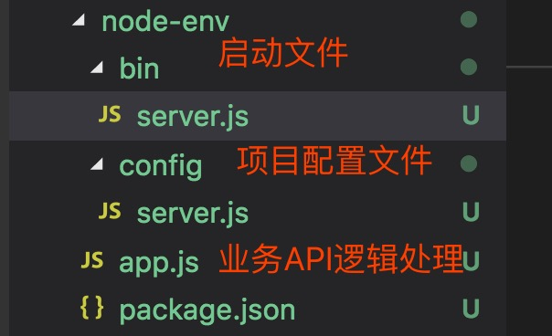

## node基础开发环境搭建

第一步：初始化项目
>npm init -y

```json
{
  "name": "node-env", // 项目名称设置
  "version": "1.0.0", // 版本设置
  "description": "", // 项目描述
  "main": "index.js", // 入口文件配置
  "scripts": { // 运行指令集合
    "test": "echo \"Error: no test specified\" && exit 1"
  },
  "keywords": [],
  "author": "",
  "license": "ISC"
}
```

第二步：项目文件结构设置

可根据项目合理设置各文件模块，例如node运行项目时需要可执行的文件，那么我们可以新建一个bin文件夹，里面放待执行的文件，业务相关设置我们可以放一块，配置相关的我们可以新建一个config...
`注意功能分层和单一职责`

demo：


详细代码设置见源代码目录。

可以看出我们平常开发用的脚手架是相对综合的一个应用场景，复杂度高很多，总之，注意功能及配置文件的分类，确保设置比较清晰。


第三步：环境变量设置

> npm install cross-env --save-dev

用于我们平时开发过程的版本设置，例如：dev, prod, test ...

```
"scripts": {
    "start": "cross-env NODE_ENV=dev node bin/server.js"
},
```

在项目具体配置中获取版本设置
```javascript
// 获取环境变量设置
const env = process.env.NODE_ENV
```

第四步：监听文件变化

> npm install nodemon --save-dev

`nodemon`启动项目会默认监听文件的变化，当文件变化会自动重启服务，我们文件变更只需刷新页面即可，当然这只是我们用到的脚手架里面热更新的一部分功能，一步步完善。

具体配置：
```
"scripts": {
    "start": "cross-env NODE_ENV=dev nodemon bin/server.js"
},
```

运行后可以看控制台命令行输出如下
```
...
[nodemon] 1.18.11
[nodemon] to restart at any time, enter `rs`
[nodemon] watching: *.*
[nodemon] starting `node bin/server.js`
...
```

至此，我们搭建了一个最基础的node开发环境。

